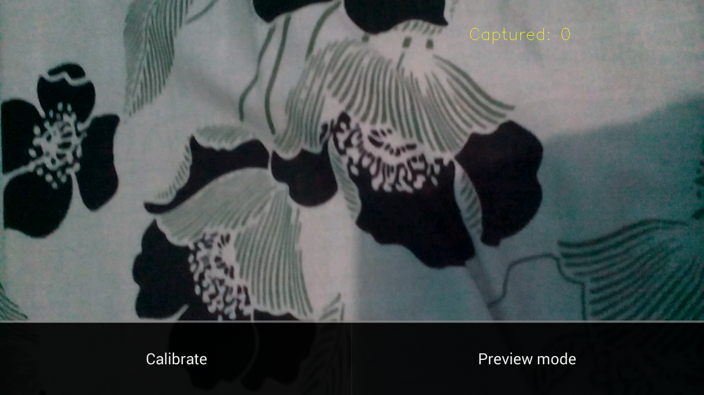

# OpenCV 3.0 - Camera Calibration

opencvcameracalibrationsample-melvincabatuan created by Classroom for GitHub

This project shows the implementation of Camera Calibration from OpenCV SDK Samples in Android Studio.

## Prerequisite:

1. Download and extract OpenCV 3.0 for Android from http://opencv.org/.
2. Refer to https://github.com/DeLaSalleUniversity-Manila/opencvcamerapreviewsample-melvincabatuan for adding OpenCV to your project.

## Accept

To accept the assignment, click the following URL:

https://classroom.github.com/assignment-invitations/965025ac304eeea5f24a06c1944cc886

## Sample Solution:

https://github.com/DeLaSalleUniversity-Manila/opencvcameracalibrationsample-melvincabatuan

## Submission Procedure with Git: 

```shell
$ cd /path/to/your/android/app/
$ git init
$ git add –all
$ git commit -m "your message, e.x. Assignment 1 submission"
$ git remote add origin <Assignment link copied from assignment github, e.x. https://github.com/DeLaSalleUniversity-Manila/secondactivityassignment-melvincabatuan.git>
$ git push -u origin master
<then Enter Username and Password>
```


## Screenshot:



"*The best programmers are not marginally better than merely good ones. They are an order-of-magnitude better, measured by whatever standard: conceptual creativity, speed, ingenuity of design, or problem-solving ability.*" - Randall E. Stross
